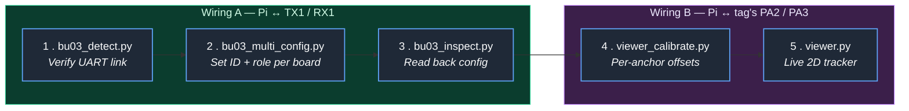

# BU03-Kit Indoor 2D Positioning System

A Raspberry Pi–based indoor positioning system using **Ai-Thinker BU03-Kit** UWB modules
(DW3000 + STM32F103). Multiple anchor boards are placed at known positions in a room;
one or more tag boards move freely. The Raspberry Pi reads live distance data from a
single "data tag" over UART, performs 2D multilateration, smooths the result with a
Kalman filter, and renders live positions in a Tkinter GUI.

---

## Table of Contents

1. [How it works (TWR)](#how-it-works-twr)
2. [Hardware](#hardware)
3. [BU03 pinout & UART roles](#bu03-pinout--uart-roles)
4. [Wiring: Pi ↔ BU03](#wiring-pi--bu03)
5. [Raspberry Pi setup](#raspberry-pi-setup)
6. [Python dependencies](#python-dependencies)
7. [Workflow overview](#workflow-overview)
8. [Step 1 — Verify UART link (`bu03_detect.py`)](#step-1--verify-uart-link-bu03_detectpy)
9. [Step 2 — Configure each board (`bu03_multi_config.py`)](#step-2--configure-each-board-bu03_multi_configpy)
10. [Step 3 — Inspect a board's saved config (`bu03_inspect.py`)](#step-3--inspect-a-boards-saved-config-bu03_inspectpy)
11. [Step 4 — Calibrate per-anchor offsets (`viewer_calibrate.py`)](#step-4--calibrate-per-anchor-offsets-viewer_calibratepy)
12. [Step 5 — Run the live viewer (`viewer.py`)](#step-5--run-the-live-viewer-viewerpy)
13. [AT command reference](#at-command-reference)
14. [Troubleshooting](#troubleshooting)
15. [Repository layout](#repository-layout)

---

## How it works (TWR)

The BU03-Kit firmware operates in **Two-Way Ranging (TWR)** mode (`AT+SETUWBMODE=0`).
TWR is the simplest UWB ranging scheme — it does not require clock
synchronisation between anchors, which makes it a good fit for low-cost setups.

For each measurement cycle, the **tag** exchanges three timestamped UWB messages with
**each anchor** in turn:

```
  Tag                                Anchor
   |  ── Poll ──────────────────────►  |
   |                                   |
   |  ◄────────────────── Response ──  |
   |                                   |
   |  ── Final ───────────────────►    |
```

From the four timestamps captured on the two devices, the tag computes the
**round-trip time of flight** and converts it into a distance (≈ time × c, where c is
the speed of light). Doing this against several anchors gives the tag a vector of
distances `[d₀, d₁, d₂, d₃, …]`.

In this project:

- The **tag** packs those distances into a binary frame and streams it out of its
  *data UART* (PA2/PA3) at 115200 baud.
- The **Raspberry Pi** is wired to that data UART, reads frames continuously, and
  uses **multilateration** (least-squares trilateration on circle intersections) to
  solve for the tag's `(x, y)` position given the known anchor coordinates.
- A **2D constant-velocity Kalman filter** smooths jitter from the raw position
  fixes before they're plotted.

### Frame format (data UART)

Each frame is 37 bytes:

| Bytes  | Field                              |
| ------ | ---------------------------------- |
| 0–2    | Header: `0xAA 0x25 0x01`           |
| 3–34   | 8 × `uint32` LE distances, in **mm** (one slot per anchor ID 0–7) |
| 35     | Reserved                           |
| 36     | Trailer: `0x55`                    |

Anchor 0's distance lives at bytes 3–6, anchor 1 at 7–10, and so on. Slots for
anchors that don't exist or aren't ranging will be 0 / garbage and are filtered out
downstream by the `0.05 m < d < 50 m`.

---

## Hardware

| Item                                   | Qty (typical) | Notes                                      |
| -------------------------------------- | ------------- | ------------------------------------------ |
| Ai-Thinker BU03-Kit (DW3000 + STM32F103) | 3+          | 1× tag + 3–4× anchors. Same hardware for both. |
| Raspberry Pi  | 1         | Tested on Pi 4B (min 4GB) / Pi 5.                     |
| Jumper wires (female-to-female)        | 4            | For Pi ↔ BU03 UART connection.             |
| Power Supply for anchors and tags (expect master anchor)                           | Lots            | Power for each BU03 board using `USB` port.                 |

The Core Electronics BU03-Kit (CE10222) is hardware-identical to the Ai-Thinker
BU03-Kit — it's just the Australian reseller. All documentation and firmware applies
unchanged.

---

## BU03 pinout & UART roles

The BU03-Kit exposes **two independent UARTs**, and this repo uses **both** — but
not at the same time, and never on the same board (mostly).


| UART       | STM32 pins | Board labels      | Used for                                                  |
| ---------- | ---------- | ----------------- | --------------------------------------------------------- |
| **UART1**  | PA9 / PA10 | `TX1` / `RX1`     | **AT command interface** — configuration only             |
| **USART2** | PA2 / PA3  | `PA2` / `PA3`     | **Binary data output** — live distance frames to the host |

Implications:

- During **configuration**, you wire the Pi to the BU03's `TX1` / `RX1` (UART1) and
  send AT commands. This is how `bu03_detect.py`, `bu03_multi_config.py`, and
  `bu03_inspect.py` talk to the board.
- During **live operation**, the Pi instead reads the BU03's `PA2` / `PA3` (USART2)
  to receive the binary distance frames. This is what `viewer.py` and
  `viewer_calibrate.py` consume.
- These are physically different pins. You will need to **rewire** between
  configuration and run-time, **or** wire both UARTs to the Pi if your Pi has a
  spare UART available (advanced; not covered here).

In practice, the simplest workflow is:
1. Wire Pi to `TX1`/`RX1`, configure each board one at a time.
2. After all boards are configured and saved (`AT+SAVE`), rewire the Pi to the
   **tag's** `PA2`/`PA3`, and run `viewer.py`.

---

## Wiring: Pi ↔ BU03

Both UARTs use 3.3 V logic at 115200 baud, 8N1, no flow control. **Cross TX↔RX.**

### A) Configuration wiring (Pi ↔ `TX1`/`RX1`)

Used by: `bu03_detect.py`, `bu03_multi_config.py`, `bu03_inspect.py`

| Raspberry Pi              | BU03-Kit            |
| ------------------------- | ------------------- |
| Pin 1  (3V3)              | `3V3`               |
| Pin 6  (GND)              | `GND`               |
| Pin 8  (GPIO14, **TXD**)  | `RX1` (PA10)        |
| Pin 10 (GPIO15, **RXD**)  | `TX1` (PA9)         |


### B) Live-data wiring (Pi ↔ `PA2`/`PA3`)

Used by: `viewer.py`, `viewer_calibrate.py`. **Wire only the *tag* board this way**
(the anchors do not need to be wired to the Pi during live operation — their
distances reach the tag wirelessly over UWB).

| Raspberry Pi              | BU03-Kit (tag)      |
| ------------------------- | ------------------- |
| Pin 1  (3V3)              | `3V3`               |
| Pin 6  (GND)              | `GND`               |
| Pin 8  (GPIO14, **TXD**)  | `PA3` (USART2_RX)   |
| Pin 10 (GPIO15, **RXD**)  | `PA2` (USART2_TX)   |

The TX direction from the Pi is unused at runtime (the firmware only emits frames),
but it's convenient to wire all four pins so you can swap roles without reseating.

---

## Raspberry Pi setup

The Pi's primary UART (`/dev/serial0`) needs to be freed from the login console and,
on Pi 3/4/5, separated from the Bluetooth controller so it routes to GPIO 14/15.

### 1. Enable the hardware UART

```bash
sudo raspi-config
```

Navigate to **Interface Options → Serial Port** and answer:

- *Would you like a login shell to be accessible over serial?* → **No**
- *Would you like the serial port hardware to be enabled?* → **Yes**

### 2. Disable Bluetooth on the PL011 UART

Edit `/boot/firmware/config.txt` (or `/boot/config.txt` on older Pis) and add:

```
dtoverlay=disable-bt
```

Save, then reboot:

```bash
sudo reboot
```

### 3. Verify the UART mapping

A helper script `check_uart.sh` is included in the repo:

```bash
chmod +x check_uart.sh
./check_uart.sh
```

You should see `/dev/serial0` exists and is symlinked to `/dev/ttyAMA*` (typically
`/dev/ttyAMA10` on Pi 5, `/dev/ttyAMA0` on Pi 3/4). All scripts in this repo open
`/dev/serial0`, so the underlying name doesn't matter as long as the symlink is
correct.

---

## Python dependencies

```bash
sudo apt-get update
pip install pyserial matplotlib
sudo apt-get install -y libopenblas-dev python3-pil.imagetk

```

| Package              | Used by                                |
| -------------------- | -------------------------------------- |
| `pyserial`           | Every script — UART I/O                |
| `matplotlib`         | `viewer.py` — embedded plot            |
| `python3-pil.imagetk`| Tkinter image rendering for matplotlib |
| `libopenblas-dev`    | NumPy / matplotlib acceleration        |

---

## Workflow overview




## Step 1 — Verify UART link (`bu03_detect.py`)

**Wiring:** A (Pi ↔ `TX1`/`RX1`)

This is a simple test: send a single `AT\r\n` and print whatever comes back.
Use it to confirm the Pi UART is configured correctly and the wiring is right
**before** doing anything else.

```bash
python3 bu03_detect.py
```

Expected output:

```
Got 6 bytes: b'\r\nOK\r\n' or similar 
```

If you see `No response`:
- Check TX↔RX are crossed (Pi TX → board RX1, Pi RX → board TX1).
- Check GND is connected.
- Confirm the board is powered (LED on USB-C side).
- Confirm `/dev/serial0` exists (`ls -l /dev/serial0`).

---

## Step 2 — Configure each board (`bu03_multi_config.py`)

**Wiring:** A (Pi ↔ `TX1`/`RX1`) — repeat for each board, one at a time.

This is where you tell each board:
- **Which device it is** (a unique numeric ID),
- **What role it plays** — *anchor* (fixed reference point) or *tag* (the thing
  being tracked),
- Which UWB **channel** and **data rate** to use.

### Anchor vs Tag — what's the difference?

| | **Anchor** | **Tag** |
|--|--|--|
| Role byte | `1` | `0` |
| Physical location | Fixed at known `(x, y)` coordinates in the room | Moves freely; we want to find its position |
| In TWR exchange | Responds to polls; reports nothing on its own UART | Initiates polls, computes distances, **outputs distance frames on PA2/PA3** |
| Wired to Pi at runtime? | No — communicates wirelessly | Yes — its data UART feeds the viewer |
| How many | 3+ (minimum 3 for 2D fix; 4+ recommended) | 1 (per data UART) |

> **Important firmware constraint:** The stock Ai-Thinker AT firmware accepts
> tag IDs 0–9 and anchor IDs 0–7. Multi-tag tracking with this firmware is
> handled by time-multiplexing — frames from each tag arrive in a round-robin
> sequence on the data UART of whichever tag is connected. See the `viewer.py`
> section for how `--tags N` interprets this.

### What to edit

Open `bu03_multi_config.py` and change **only** the `DEVICE` variable near the top:

```python
# --- Pick which board you are configuring right now ---
DEVICE = "ANCHOR0"   # ← change this for each board you flash
```

Valid values come from the `DEVICE_TABLE` dict in the same file:

```python
DEVICE_TABLE = {
    # Anchors
    "ANCHOR0": (0, 1),
    "ANCHOR1": (1, 1),
    "ANCHOR2": (2, 1),
    "ANCHOR3": (3, 1),
    # Tags
    "TAG0":    (0, 0),
    "TAG1":    (1, 0),
    # ...
    "TAG9":    (9, 0),
}
```

Each entry is `(id, role)` where `role=1` is anchor and `role=0` is tag. Everything
else (channel, rate, UWB mode) is shared by all boards and should not normally be
changed:

```python
CHANNEL = 1     # 1 = Channel 5 (6489.6 MHz)
RATE    = 1     # 1 = 6.8 Mbps
UWBMODE = 0     # 0 = TWR (Two-Way Ranging)
```

### Run

```bash
python3 bu03_multi_config.py
```

The script will:
1. Send `AT` to confirm the link.
2. Send `AT+SETUWBMODE=0` (TWR mode).
3. Send `AT+SETCFG=<id>,<role>,<channel>,<rate>`.
4. Send `AT+SAVE` (writes to flash so the setting survives power cycles).
5. Read back the config with `AT+GETCFG` / `AT+GETUWBMODE`.
6. Send `AT+RESTART`.
7. Stream any further AT-UART output (mostly silent — distance frames go out PA2/PA3).

**Repeat for every board.** Disconnect, edit `DEVICE = "..."`, reconnect the next
board, and run again.

---

## Step 3 — Inspect a board's saved config (`bu03_inspect.py`)

**Wiring:** A (Pi ↔ `TX1`/`RX1`)

A read-only sanity-check tool. Use it any time you want to confirm what's actually
saved on a board without changing anything.

```bash
python3 bu03_inspect.py
```

Output:

```
==================================================
 BU03-Kit Configuration
==================================================
 Link:           OK
 Firmware:       <version string>
 Device ID:      0
 Role:           ANCHOR  (raw: 1)
 Channel:        Channel 5 (6489.6 MHz)  (raw: 1)
 Data rate:      6.8 Mbps  (raw: 1)
 UWB mode:       TWR (Two-Way Ranging)  (raw: 0)
==================================================
```

Useful flags:
- `--json` — emit machine-readable output for scripting.
- `--raw` — also print the raw firmware response strings (helpful when debugging).

---

## Step 4 — Calibrate per-anchor offsets (`viewer_calibrate.py`)

**Wiring:** B (Pi ↔ tag's `PA2`/`PA3`)

UWB ranges have a per-radio-pair bias caused by RF front-end delays, antenna
mounting, and PCB layout. A typical bias is on the order of ±20 cm, which dominates
the position error in a small room. Calibration measures that bias for each anchor
so the viewer can subtract it.

### Procedure (one anchor at a time)

1. Power on **only one tag** and **only the anchor you're calibrating**. (Or all
   anchors — they don't interfere — but only one tag is recommended; see warning
   below.)
2. Place the tag at a **measured, known distance** from the anchor (e.g., exactly
   1.500 m away with a tape measure). Hold it still.
3. Run the calibrator, telling it which anchor and the true distance:

   ```bash
   python3 viewer_calibrate.py --anchor 0 --true-distance 1.500 --seconds 20
   ```

4. The script captures samples for 20 seconds, then prints:

   ```
    -> Offset for anchor 0: +0.082 m
       (add this value to anchor 0's readings to correct)

    In your viewer config, add:
      ANCHOR_OFFSETS[0] = 0.082
   ```

5. Repeat for every anchor.

### Apply the offsets

Open `viewer.py` and edit the `ANCHOR_OFFSETS` dictionary:

```python
ANCHOR_OFFSETS = {
    0:  0.082,
    1: -0.041,
    2:  0.117,
    3:  0.005,
}
```

> ⚠️ **Multi-tag warning:** the firmware time-multiplexes frames between tags, so
> with N tags powered up, only every Nth frame is from the calibrating tag.
> Always calibrate with `--n-tags 1` (the default).

---

## Step 5 — Run the live viewer (`viewer.py`)

**Wiring:** B (Pi ↔ tag's `PA2`/`PA3`)

The end product. Reads distance frames from the tag, multilaterates, Kalman-filters,
and shows a live 2D plot with a table of per-tag coordinates.

### Configure your room

Edit the constants at the top of `viewer.py`:

```python
# Anchor positions in metres, in your room's coordinate frame.
ANCHORS = {
    0: (0.0, 0.0),
    1: (1.8, 0.20),
    2: (1.8, -0.69),
    3: (0.0, -0.69),
}

# From viewer_calibrate.py
ANCHOR_OFFSETS = {
    0: 0.0,
    1: 0.0,
    2: 0.0,
    3: 0.0,
}

# Plot bounds: (x_min, x_max, y_min, y_max)
VIEW_BOUNDS = (0.0, 2.0, -1.0, 0.5)
```

The anchor IDs here **must match** the IDs you set in step 2.

### Run

```bash
# Track 1 tag, fullscreen
python3 viewer.py --tags 1

# Track 2 tags, windowed (good for laptops / VNC)
python3 viewer.py --tags 2 --windowed

# Skip drawing distance circles (faster on slow Pis)
python3 viewer.py --tags 2 --no-circles
```

### Controls

| Key                       | Action                       |
| ------------------------- | ---------------------------- |
| `Q` / `Esc`               | Quit                         |
| Color dropdown (per row)  | Reassign colors between tags |

### How `--tags N` works

Because the firmware time-multiplexes frames across tags on the data UART, the
viewer assigns successive incoming frames to row 0, row 1, … row N−1, then back to
row 0. If you set `--tags` higher than the number of powered-on tags, some rows
will simply never get fresh data and will show as stale (empty).

---

## AT command reference

The full AT command set is documented in [`docs/AT_command.pdf`](docs/AT_command.pdf).

The commands used in this repo are:

| Command                              | Purpose                                              |
| ------------------------------------ | ---------------------------------------------------- |
| `AT`                                 | Link check; firmware replies `OK`                    |
| `AT+GETVER`                          | Print firmware version                               |
| `AT+SETUWBMODE=<n>`                  | Set UWB mode: `0`=TWR, `1`=PDOA                      |
| `AT+GETUWBMODE`                      | Read current UWB mode                                |
| `AT+SETCFG=<id>,<role>,<ch>,<rate>`  | Set device ID, role (0=tag, 1=anchor), channel, rate |
| `AT+GETCFG`                          | Read saved configuration                             |
| `AT+SAVE`                            | Persist current settings to flash                    |
| `AT+RESTART`                         | Soft-reboot the module to apply settings             |

All commands are terminated with `\r\n` (CRLF) — required by the firmware.

---

## Troubleshooting

| Symptom                                          | Likely cause                                                   | Fix                                                              |
| ------------------------------------------------ | -------------------------------------------------------------- | ---------------------------------------------------------------- |
| `bu03_detect.py` says "No response"              | TX/RX swapped, GND missing, or wrong UART pins                 | Re-check wiring A; confirm you're on `TX1`/`RX1` not `PA2`/`PA3` |
| `Could not open /dev/serial0`                    | Console still owns the UART, or `dtoverlay=disable-bt` missing | Re-run `raspi-config`, edit `config.txt`, reboot                 |
| Config commands echo but no `OK`                 | Baud mismatch, or board in PDOA mode and confused              | Try `AT+SETUWBMODE=0` first; cycle power                         |
| Viewer shows no dot, just "—" in the table       | No frames arriving on `PA2`/`PA3`                              | Confirm wiring B; confirm tag is configured as `role=0`; confirm 3+ anchors are powered and in range |
| Position jumps wildly                            | Anchor positions in `viewer.py` don't match physical layout    | Re-measure; remember `(x, y)` is in your chosen room frame       |
| Constant offset in all positions                 | Per-anchor bias not corrected                                  | Run `viewer_calibrate.py` for each anchor                        |
| Only 1 tag shows even with `--tags 2`            | Second tag not powered, out of range, or not configured        | Re-check with `bu03_inspect.py` on the second tag                |

---

## Repository layout

```
.
├── README.md                  # this file
├── check_uart.sh              # confirms /dev/serial0 mapping
├── bu03_detect.py             # step 1 — UART smoke test
├── bu03_multi_config.py       # step 2 — set ID/role per board
├── bu03_inspect.py            # step 3 — read back saved config
├── viewer_calibrate.py        # step 4 — per-anchor offset measurement
├── viewer.py                  # step 5 — live 2D tracker GUI
└── docs/
    ├── AT_command.pdf         # full AT command reference
    └── bu03-uart-pinout.jpg   # BU03 board pinout
```

---

## Credits

Built around the Ai-Thinker BU03-Kit (DW3000 + STM32F103). Hardware datasheet and
AT command reference: <https://en.ai-thinker.com/pro_view-158.html>.

Core Electronics BU03 Spatial Tracking Guide <https://core-electronics.com.au/guides/diy-2d-and-3d-spatial-tracking-with-ultra-wideband-arduino-and-pico-guide/>